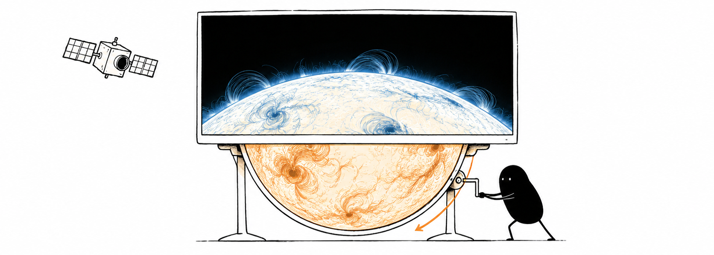

# Solar Horizon

Download NASA solar images, create animated macOS desktop and screensaver.



<p align="right"><sub>Illustration created with the <code>ian-xiaohei-illustrations</code> skill.</sub></p>

Requires Python 3.11 or newer.

## Download images

```sh
python3 solar_horizon.py
```

Saves seven AIA views at 4096 × 4096 to `~/Pictures/sdo-feed`.
No third-party packages required.
Use `--help` for options or see the [usage guide](docs/usage.md).

## Solar Horizon for macOS

Three views: **Solar Horizon**, **Surface Scroll** and **Solar Peek**, with daily image refreshes and a companion screensaver.
Requires Apple Silicon, macOS 14 or later, and Xcode.

```sh
python3 scripts/install.py
```

Choose a view from the menu bar and select Solar Horizon in System Settings > Screen Saver.
See the [macOS guide](docs/solar-horizon.md) for setup, controls and compatibility.

## Plasma wallpapers

```sh
uv run --with-requirements requirements-wallpaper.txt python solar_horizon.py --views aia_193 --wallpaper 3840x2160
```

Creates a close-up in `~/Library/Caches/Solar Horizon/wallpapers`, preserving the original image.
See [wallpaper options](docs/usage.md#plasma-wallpapers) for other sizes and offline cropping.

## More

- [Development and testing](CONTRIBUTING.md)
- [Image-quality experiments](docs/image-quality.md)
- [Validation record](docs/solar-horizon-validation.md)
- [Roadmap](ROADMAP.md)

Images courtesy of NASA/SDO and the AIA, EVE and HMI science teams.
Based on [BigPicture.py](https://gist.github.com/prehensile/675906) by Henry Cooke, via the [original fork](https://gist.github.com/mint5auce/ec6e81b2bcb30b617c80).
