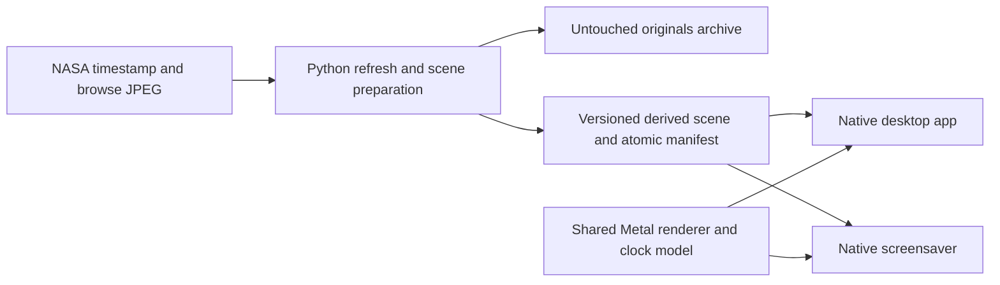

# Solar Horizon implementation plan

Status: recommended decisions approved by Jonny; implementation in progress.
Prepared on 29 September 2026 against the current working tree.
The original design and acceptance criteria are retained below.
See README.md and solar-horizon-validation.md for the implementation and verification status.

## Intended result

Create a calm, continuously animated solar horizon using the latest available SDO/AIA 193 Å observation and the selected teal / pewter treatment.
Keep the horizon's position, curvature, and black background fixed while the solar image rotates clockwise through exactly 360 degrees every 1,200 seconds.
Show the outer band through the horizon crop, with restrained glow and constant angular velocity.
Use the same scene and rotation phase for the desktop and screensaver.
Refresh the source once daily, preserve original downloaded bytes, and keep all derivatives and application state outside the originals directory.

The motion is an artistic rotation of a still image in its own plane.
The centre stays outside the horizon crop, and the animation does not represent the Sun's physical rotation or a time sequence of observations.

Visual references:

- Colour: [selected teal / pewter treatment](../output/wallpaper-duotones-and-multicolour-2026-09-29/01-duotone-teal-pewter.png).
- Composition: [original solar horizon concept](../output/wallpaper-concepts-2026-09-28/01-solar-horizon.png).

These generated concepts establish the appearance.
Production scenes will be derived deterministically from downloaded solar images, with no daily image-generation calls or invented surface detail.

## Scientific name and source identity

Use **SDO/AIA 193 Å** in the interface and documentation.
An expanded label is **Solar Dynamics Observatory / Atmospheric Imaging Assembly, 193 Å extreme ultraviolet**.
193 Å equals 19.3 nm.
The channel includes emission from Fe XII and, in hot flare plasma, Fe XXIV; naming it only "Fe XII" would omit part of its response.
NASA describes the channel and these emissions in its [193 Å visualisation documentation](https://svs.gsfc.nasa.gov/3981).

Keep `aia_193` as the existing CLI identifier and `0193` as NASA's filename channel code.
The channel alone does not identify an observation: record the UTC observation timestamp, source URL, resolution, and SHA-256 alongside it.
"Original" means the untouched NASA browse JPEG, including its supplied colour table and timestamp footer.
It does not mean a calibrated raw scientific FITS product.
The teal / pewter grade is an aesthetic rendering and should be identified as such in scene information.

## Current code and verified findings

- `solar_horizon.py` already resolves `aia_193` to NASA's `0193` channel, reads its observation timestamp, and fetches the corresponding timestamped browse JPEG.
- The CLI currently defaults to seven channels at 4096 × 4096 and saves to `~/Pictures/sdo-feed`.
- Its normal skip policy reuses any saved image from the same UTC observation day; it can therefore skip a newer observation from that day.
- `wallpaper.py` creates deterministic static plasma crops and deliberately keeps the crop inside an inset solar disc, excluding the limb, corona, and footer.
- `solar_radius()` returns an inset safe radius, not the actual limb radius required for this horizon.
- Derived wallpapers currently default to `OUTPUT/wallpapers`, which conflicts with the requested separation of originals and derivatives.
- There is no native macOS wallpaper host, screensaver target, or daily scheduler in the inspected application files.
- The current working tree contains existing edits to `README.md`, `solar_horizon.py`, and `tests/test_solar_horizon.py`, plus new wallpaper code, tests, dependencies, and concept assets.
  Implementation must build on and preserve that work.
- The development Mac reports macOS 27.0, Apple M5, and one internal display.
  It reports 2940 × 1912 backing pixels with a 1470 × 956 logical mode; actual rendering dimensions must be obtained from the current drawable at runtime.
- Xcode is installed, and its current macOS SDK includes `ScreenSaverView`.
  Header availability does not establish that a custom Metal screensaver, its file access, or a seamless handoff works on this Mac.
- A live check at 2026-09-29 09:44 UTC returned `0193: 20260921_153805` from NASA's latest timestamp endpoint.
  The primary source was therefore about eight days old during planning.

## Decisions requested

Jonny accepted the recommended choices and requested implementation.

| Decision | Recommended proposal | Approval status |
| --- | --- | --- |
| Playback architecture | Retain the Python downloader and add a small native macOS app plus a companion screensaver sharing one renderer | Accepted |
| Automatic download scope | Fetch AIA 193 Å for the daily scene; retain the other channels as manual CLI options | Accepted |
| Original retention | Keep all originals initially; prune only disposable derived data | Accepted |
| Daily schedule | 08:00 in the Mac's local timezone, with overdue work caught up after wake or login | Accepted |
| Rotation direction | Clockwise, producing rightward motion across the top of the horizon | Accepted |
| Daily scene change | Crossfade over 10 seconds at the existing rotation phase | Accepted |
| Power behaviour | Stop rendering while hidden, sleeping, or screen-off; use 60 fps on mains and 30 fps on battery if measurements justify the difference | Accepted |
| Initial delivery | Personal installation on this Mac, with display-aware layout and tests for multiple displays; public distribution is a later scope decision | Accepted |

An existing player such as Backdrop remains an alternative if preferred.
Its desktop and Lock Screen support does not by itself establish exact phase continuity, so the native architecture is the recommended starting point for this requirement.

## Architecture



Keep downloading, validation, colour grading, and scene preparation in the Python application.
Add a small AppKit macOS host with a menu-bar controller and a desktop-level, non-interactive rendering window.
Implement the screensaver as a `ScreenSaverView` wrapper around the same rendering core.
Use Metal/MetalKit for a rotating texture and a fixed viewport, avoiding a separate video frame or image file for every animation step.
Share the renderer, geometry, clock, colour-space handling, and scene schema between both native targets.
Resolve shader resources from the appropriate component bundle rather than assuming the screensaver host's `Bundle.main` is ours.

The screensaver reads already prepared scenes and runs without Python, a network connection, or the desktop app process.
Both hosts should be able to display the last usable scene after an independent restart.
The downloader remains the sole publisher of source and scene state.

## Originals, derived files, and safe publication

Proposed runtime layout:

```text
~/Pictures/sdo-feed/
    aia_193_<UTC timestamp>_4096_0193.jpg   # Only untouched originals

~/Library/Application Support/Solar Horizon/
    config.json
    refresh-state.json
    scene.json                           # Atomic active-scene pointer
    scenes/<source hash>-<profile version>/
        texture.png                      # Full rotationally safe texture
        manifest.json                    # Provenance, geometry, grade version

~/Library/Caches/Solar Horizon/
    previews/
    scratch/

~/Library/Logs/Solar Horizon/
    refresh.log
```

The exact location readable by the screensaver host must pass the compatibility spike before this layout is finalised.
Do not assume that the screensaver inherits the app's filesystem permissions or can read a sandboxed app container.

Rules:

1. Preserve original JPEG bytes and existing source filenames.
2. Put no wallpaper, cropped image, preview, log, sidecar metadata, or persistent temporary file in the originals directory or a child directory.
3. Stage original downloads outside the originals directory on the same filesystem, then atomically rename the validated file into it.
   A custom destination on another volume needs its own external staging location on that volume, rather than a cross-volume rename.
4. Publish each derived scene as an immutable versioned directory, then atomically replace the active manifest only when the texture and metadata are complete.
5. Record channel, source URL, observation time, fetch time, source hash, original dimensions, detected limb geometry, colour-profile version, and renderer schema version in derived metadata.
6. Keep the active and previous scene pinned while a transition or reader may need them.
   Remove only inactive, recognised derivatives under the managed derived-data roots.
7. Keep downloaded originals indefinitely unless an explicit retention policy is approved.
8. Provide an explicit migration report for existing `sdo-feed/wallpapers` content, with collision handling and hash verification before any move.
   Do not delete unknown files or move existing material during installation without an approved migration choice.
9. Keep generated runtime files and native build products out of version control.
   Existing concept assets in the repository's `output/` folder are design work and must not be silently removed.

## Daily acquisition and freshness

Continue using NASA's latest timestamp to select an observation and its timestamped browse URL to download stable bytes.
NASA documents the available channel codes, resolutions, and browse naming conventions in its [browse-data access guide](https://sdo.gsfc.nasa.gov/data/bestpractice.php).

Add a named solar-horizon mode to the existing CLI, with explicit source, derived-output, and refresh-policy settings.
The daily mode should request a 4096 × 4096 AIA 193 Å image and compare the exact observation timestamp and hash.
Preserve the existing one-per-observation-day policy for ordinary archival CLI use, so existing behaviour changes only when the new mode is selected.
A manual refresh in horizon mode may acquire a newer observation from the same UTC day.

Validate a candidate by fully decoding it, checking dimensions, verifying the expected image format, and locating a plausible solar disc before publishing a scene.
Keep an untouched, successfully validated original even if later colour grading or scene construction fails.
Reject incomplete files, invalid image content, nonsensical future timestamps, and observations older than the active scene.

Track three different times: observation time in UTC, download time, and the local scheduled refresh slot.
A successful request does not mean the observation is fresh.
If the newest available observation is more than 24 hours old, show a stale-source status in the menu and logs while continuing the last valid scene.
If no previous scene exists, a valid stale image may be used with its real observation date clearly reported in scene information.
Keep status information off the wallpaper itself.

Use a per-user `launchd` job with an absolute interpreter path, explicit arguments, and a managed dependency environment.
Do not install packages or resolve dependencies during the daily run.
Use a calendar trigger plus a login/overdue check, a single-process lock, and persistent success state to prevent duplicate concurrent work.
Apple documents that a missed calendar job runs after waking from sleep, but not automatically after the machine was powered off, hence the separate overdue check at login.
See [Apple's scheduling guide](https://developer.apple.com/library/archive/documentation/MacOSX/Conceptual/BPSystemStartup/Chapters/ScheduledJobs.html).

After a transient network failure or stale upstream response, allow a small bounded retry schedule, proposed at 30 minutes, 2 hours, and 6 hours.
Persist the next attempt time and use a scheduler trigger rather than keeping a sleeping Python process alive.
Successful fresh daily work suppresses further automatic fetches until the next due slot.
Refresh on login or wake only when work is overdue or a retry is due.

Do not silently substitute a different instrument or wavelength when NASA is stale.
A second independently verified AIA 193 Å source is a suggested follow-up improvement, with its provenance, orientation, resolution, and tone mapping checked before adoption.

## Colour treatment and horizon geometry

Create a versioned, deterministic teal / pewter profile, calibrated visually against the selected concept.
Use image intensity to blend smoky petrol-teal shadows into warm pewter highlights, with restrained saturation, protected highlight detail, and deep black space.
Process the grade in a defined colour space and ensure Python output, Metal sampling, and static previews agree.
The existing NASA JPEG has already been colour-mapped; its brightness is suitable for aesthetic grading but must not be described as calibrated EUV intensity.

Retain the complete usable circular texture needed for all rotation angles.
Do not rotate the already cropped widescreen concept, which would expose corners and empty areas.
Apply the horizon crop at render time, and create static previews from the same renderer.

Refactor disc analysis so it can expose the actual centre, limb radius, and confidence separately from the inset safety radius used by the existing plasma cropper.
Normalise each daily image to consistent disc geometry so the horizon does not shift as source framing varies.
Use a rotationally safe circular domain that excludes the timestamp/footer and image edges at every angle.
Fade only the outer low-intensity background into black, preserving the visible limb and available corona.
If a reliable clean domain cannot be determined, keep the previous scene and report the rejected candidate.

Initial geometry for visual review:

- Horizontal centre: `0.5 × viewport width`.
- Limb radius: approximately `1.0 × viewport width`.
- Highest point of the horizon: approximately `0.48 × viewport height`.
- Disc centre: one limb radius below that highest point, outside the visible screen.
- Preserve circular geometry; never stretch the texture to the screen's aspect ratio.

These values are starting parameters to match the approved horizon concept, rather than a new automatic aesthetic crop search each day.
Preview them on the actual internal display and on 16:9 and ultrawide viewports.
The inner disc stays below the viewport throughout the revolution.

Use the real corona as the principal glow source.
If an additional bloom pass is needed to match the reference, keep it fixed, faint, spatially bounded, and identical in both hosts.
Avoid animated pulsing or exposure changes.
Document the effective source scale where the horizon requires upscaling; a larger output does not add captured detail.

## Rotation and desktop-to-screensaver continuity

Define rotation analytically rather than incrementing the angle once per frame:

```text
period = 1,200 seconds
angular speed = 360 / 1,200 = 0.3 degrees per second
angle(t) = phase offset + direction × 2π × fractional_part(shared_time(t) / period)
```

Use a monotonic system clock shared across processes that includes time spent asleep, with one persisted phase-offset setting.
Apple documents this behaviour for [mach_continuous_time](https://developer.apple.com/documentation/kernel/1646199-mach_continuous_time); select and test the corresponding API in the implementation.
Both processes must use the same clock definition, unit conversion, and offset.
The loop continues logically while rendering is suspended, so resuming does not require simulating missed frames.
Continuity is required across desktop/saver handoff, application restarts in the same boot session, and sleep/wake.
Phase persistence across a full reboot is optional and does not justify introducing wall-clock adjustment jumps into normal playback.

Render the same texture at the same angle, viewport geometry, brightness, colour space, and glow settings in both hosts.
Preload the next scene before use and avoid a black first frame when the screensaver starts.
Keep the current rotation phase when a new daily source becomes available.
For the proposed 10-second daily crossfade, publish the old and new scene IDs plus one shared transition start time so both hosts calculate the same blend.

When a host is inactive, stop drawing and GPU work while leaving the analytical rotation clock running.
The screensaver must release its timer and rendering resources through its lifecycle callbacks.
The desktop host must handle Spaces, Mission Control, Stage Manager, display changes, lock/unlock, and full-screen applications without stealing focus or intercepting input.
Limit desktop window placement to the normal wallpaper area below desktop icons and widgets.

Apple provides a public [ScreenSaverView API](https://developer.apple.com/documentation/screensaver/screensaverview), but macOS controls the transition between desktop, screensaver, and authentication UI.
A shared angle makes the scene consistent; it does not guarantee control over system fades, compositing delays, or the login screen after a reboot.
Treat a visually smooth transition on this macOS 27 installation as a tested release criterion.
Do not promise the initial login/FileVault screen as part of this scope.

## Implementation sequence

### 0. Prove native hosting and handoff

Build a minimal desktop host and `.saver` that draw the same local test scene with the shared phase calculation.
Validate Metal rendering, shader loading, selected shared-directory access, screensaver preview, real activation, lock/unlock, and independent process startup on macOS 27.
Use the test scene to measure whether a matching frame can be shown at the handoff.
Confirm a supported signing and installation route for a personal local build.
Complete this spike before investing in production controls or a full scheduler.
If the native saver cannot run or access prepared scenes reliably, document the specific constraint and bring the existing-player alternative back for a decision.

### 1. Separate source acquisition and scene storage

Extend the downloader with exact-observation refresh mode, complete image validation for horizon use, provenance, and safe staging outside the source directory.
Introduce the derived-scene directory and atomic manifest contract.
Add path validation that prevents the configured derived location from being the originals directory or a descendant, including symlink-resolved paths.
Preserve current archival CLI semantics and existing plasma-crop behaviour.

### 2. Produce the approved static appearance

Implement actual-limb analysis, footer-safe circular masking, and the versioned teal / pewter profile.
Render a horizon preview at the actual display dimensions from the full-resolution source.
Review the crop, saturation, shadow detail, glow, and effective sharpness against the selected references.
Approve this static frame before final animation tuning.

### 3. Complete the shared animation core

Implement the analytical 1,200-second rotation and normalised horizon geometry in a shared native module.
Add deterministic rendering at explicit timestamps for comparison tests and previews.
Implement matching daily-source crossfades, versioned scene loading, last-good fallback, and resource lifecycle handling.

### 4. Integrate the desktop and screensaver

Finish the desktop window behaviour and screensaver lifecycle around the proven shared core.
Add minimal controls for pause/resume, preview, refresh now, source observation time/status, open originals, and installation status.
Respect Reduce Motion with a static presentation; keep this separate from the ordinary constant-speed mode.
Provide an offline static fallback using the same composition.

### 5. Add the daily schedule and packaging

Provide a repeatable personal installation with an explicit Python runtime/dependency location, native app, companion saver, and per-user refresh job.
Implement due-slot tracking, single-flight refreshes, bounded retries, log rotation, cache retention, and overdue checks.
Provide a reversible uninstall procedure that preserves originals and user-created work.
Public distribution, notarisation, and a bundled Python runtime are a separate packaging decision if the project later needs to run on other Macs without local setup.

### 6. Validate and document

Run the existing suite and add focused tests for the new failure modes and invariants listed below.
Complete full-duration playback and real screensaver testing on the target Mac.
Measure resource use and compare visual quality at the proposed frame rates.
Update the README with source terminology, installation, schedule, directories, source freshness, and troubleshooting once implementation behaviour is verified.

## Proposed code organisation

| Area | Planned responsibility |
| --- | --- |
| `solar_horizon.py` | Keep CLI compatibility; add horizon-mode orchestration and precise refresh policy |
| `wallpaper.py` | Preserve static plasma mode; expose reusable disc-analysis primitives without changing its safety inset |
| `solar_scene.py` | Deterministic grading, clean circular texture preparation, scene manifests, and derived cache handling |
| `refresh.py` or equivalent module | Due-slot state, process locking, freshness rules, retry policy, and publication |
| `macOS/SolarSceneCore/` | Shared scene model, phase clock, geometry, Metal renderer, and timestamp-driven preview support |
| `macOS/SolarHorizonApp/` | Menu-bar app, desktop windows, lifecycle handling, and scene status |
| `macOS/SolarHorizonSaver/` | Thin `ScreenSaverView` integration with the same core |
| `scripts/` | Installation, verification, and reversible uninstallation of personal runtime components |
| `tests/` and native tests | Source isolation, transformation invariants, refresh behaviour, geometry, phase, and lifecycle coverage |

Module boundaries can be adjusted to fit the first compatibility spike.
Avoid building a general wallpaper framework or a large preferences application for this first release.

## Acceptance criteria and verification

| Requirement | Evidence required |
| --- | --- |
| Correct source | Channel is AIA 193 Å / `0193`; source timestamp, URL, and SHA-256 identify the selected observation |
| Clean originals | Before/after hashes are unchanged; source tree contains only permitted originals; all derived paths are outside it |
| Correct refresh behaviour | A newer same-day observation is acquired in horizon mode; unchanged observations are reused; legacy archival tests still pass |
| Robust failures | Offline, stale, malformed, truncated, future-dated, older, and concurrent-update cases preserve the last usable scene |
| Stable appearance | Approved static preview matches teal / pewter intent and horizon geometry across representative viewport sizes |
| Safe full rotation | Sample frames throughout 360 degrees contain no footer, stamp, rectangular corner, clipped texture edge, or unintended halo |
| Exact loop | Rendering at `t` and `t + 1,200` agrees within numeric/rendering tolerance; intermediate angles prove constant 0.3 degrees/second |
| Frame-rate independence | 30 fps, 60 fps, dropped frames, delayed starts, and sleep/wake resolve to the correct time-based angle |
| Shared phase | Desktop and saver evaluate the same phase within one displayed frame for the same timestamp, source, and viewport |
| Daily replacement | Both hosts use the same old/new source and blend progress; texture replacement produces no blank frame or phase reset |
| Real handoff | Screen recordings of repeated desktop/saver/lock/unlock cycles show stable framing and no scene restart on the target Mac |
| Lifecycle | Saver preview, app quit/relaunch, displays being attached or removed, Spaces, full-screen apps, and display sleep behave correctly |
| Resource use | No network/decode work per frame, no busy loop, no ongoing draws while inactive, and no memory growth across a full 20-minute run |
| Scheduling | Local-time schedule, daylight-saving changes, login after missed work, wake after missed work, retries, and process locking are tested |
| Recovery | Scene/cache corruption is repairable from an original; uninstall preserves the archive; fresh installation has a usable first-run state |

Use small labelled synthetic fixtures to prove geometry and footer exclusion, plus real 4096-pixel solar observations for visual review.
At least one test should move a feature around the complete source circumference so a misplaced rotation centre is obvious.
Run a full 20-minute playback test in addition to timestamp-based loop tests.
Assess CPU, GPU, memory, and energy on the actual Mac rather than inferring efficiency from frame rate alone.

## Suggested improvements for approval

1. **Freshness visibility and last-good fallback:** include observation age in the menu and logs, since the upstream source is currently stale.
2. **Gentle daily updates:** crossfade to a new observation over 10 seconds while preserving rotation phase.
3. **Adaptive rendering:** stop invisible work and evaluate 30 fps on battery, with the same 20-minute period at every frame rate.
4. **Source provenance:** keep all identifiers and transformation settings in derived manifests, making every displayed scene reproducible from its original.
5. **Independent fallback source:** research a second verified AIA 193 Å endpoint if daily freshness is important during NASA browse-service outages.
   This requires a separate source-validation decision; it is not an automatic change in the first implementation.

The next implementation step after resolving the pending choices is the native hosting and handoff spike.

## Planning verification

The existing baseline was run with `python3 -m unittest discover -s tests -v` on 29 September 2026.
Twenty tests passed and twelve tests were skipped because the active Python environment lacks the optional wallpaper packages.
No packages were installed for this planning pass.
The skipped crop tests and native rendering, resource use, filesystem access from the screensaver, and real handoff behaviour remain unverified.
The plan's local image-reference links and Markdown code-fence balance were checked.
Only this plan document was created during the planning pass; existing application and design work was preserved.
